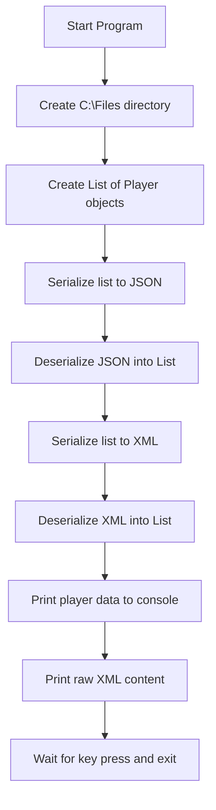
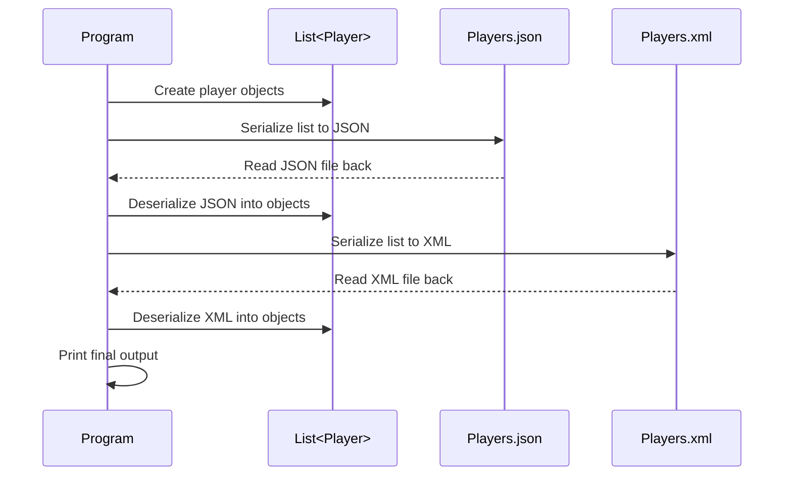
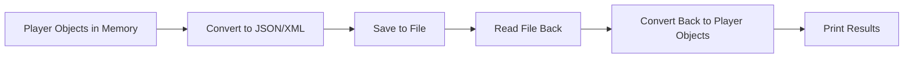
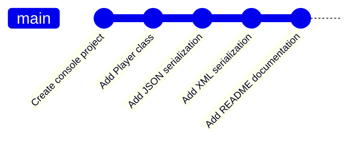

# Assignment 10.1 - Player Serialization

> A C# console application that demonstrates how to create a user-defined class and serialize and deserialize objects using **JSON** and **XML**.

---

## Overview

This project was created for **Assignment 10.1**. The goal was to build a user-defined class with three properties and demonstrate how object data can be serialized and deserialized using multiple file formats.

In this project, I created a `Player` class and used a list of basketball players to demonstrate:

- JSON serialization and deserialization
- XML serialization and deserialization
- File creation and file reading in C#
- Round-trip validation by printing restored data back to the console

---

## Why this project matters

This assignment reinforces several important C# concepts that show up often in backend and application development:

- Creating custom classes
- Working with collections of objects
- Using built-in serializers
- Reading from and writing to files
- Verifying that stored data can be restored correctly

It also helped strengthen my ability to explain program flow clearly and document technical work in a more professional format [cite:11].

---

## Tech Stack

- **Language:** C#
- **Framework:** .NET Console Application
- **Serialization Libraries:**
  - `System.Text.Json`
  - `System.Xml.Serialization`
- **IDE:** Visual Studio
- **Version Control:** Git

---

## Project Structure

```text
Rovy Assignment List Serialization (Json & XML)/
├── README.md
├── Program.cs
├── Player.cs
├── Rovy Assignment List Serialization (Json & XML).csproj
└── Properties/
```

---

## Player Class

This project uses a custom `Player` class with three properties:

| Property | Type | Description |
|---|---|---|
| `Name` | `string` | Player name |
| `Team` | `string` | Team name |
| `PointsPerGame` | `float` | Average points scored per game |

Example:

```csharp
public class Player
{
    public string Name { get; set; }
    public string Team { get; set; }
    public float PointsPerGame { get; set; }
}
```

---

## Program Workflow



---

## Serialization Flow



---

## Whiteboard Explanation

If this project had to be explained on a whiteboard, the process would break down into four simple steps.

### Step 1: Create the data

A custom `Player` class is created with three properties:

- Name
- Team
- PointsPerGame

A list of `Player` objects is then populated with sample data.

### Step 2: Serialize the list

Serialization means converting objects in memory into a format that can be stored in a file.

In this application:

- JSON serialization writes the player list to a `.json` file
- XML serialization writes the player list to a `.xml` file

### Step 3: Deserialize the list

Deserialization means reading stored file data and turning it back into C# objects.

In this project:

- The JSON file is read back into a `List<Player>`
- The XML file is read back into a `List<Player>`

### Step 4: Verify the round trip

To confirm the process worked correctly:

- The deserialized players are printed to the console
- The raw XML content is displayed for inspection

### Simple diagram



That full round trip is:

**object -> file -> object again**

---

## JSON Process

The JSON portion of the program follows these steps:

1. Create the file path.
2. Open a file stream.
3. Serialize the `List<Player>` into the JSON file.
4. Reset the stream position to the beginning.
5. Deserialize the file back into a `List<Player>`.
6. Print each restored player to the console.

---

## XML Process

The XML portion of the program follows these steps:

1. Create the file path.
2. Create an `XmlSerializer` for `List<Player>`.
3. Write the player list into the XML file.
4. Open the XML file again for reading.
5. Deserialize the XML back into a `List<Player>`.
6. Print each restored player to the console.
7. Read and display the raw XML text.

---

## Example Console Output

```text
--- JSON Serialization ---

List serialized to JSON. Reading it back...

Jalen Brunson - New York Knicks - 25.6
Victor Wembanyama - San Antonio Spurs - 22.3
Michael Jordan - Chicago Bulls - 33.4

--- XML Serialization ---

List serialized to XML. Reading it back...

Jalen Brunson - New York Knicks - 25.6
Victor Wembanyama - San Antonio Spurs - 22.3
Michael Jordan - Chicago Bulls - 33.4

--- Raw XML content ---
<?xml version="1.0"?>
<ArrayOfPlayer>
  ...
</ArrayOfPlayer>
```

---

## How to Run

1. Open the project in **Visual Studio**.
2. Build the solution.
3. Run the program.
4. View the console output.
5. Check the generated files in:

```text
C:\Files
```

Expected files:

- `Players.json`
- `Players.xml`

---

## Development Flow



---

## What I Learned

This project helped build confidence in:

- Creating user-defined classes
- Working with lists of objects
- Writing structured data to files
- Reading stored data back into objects
- Understanding the differences between JSON and XML
- Explaining serialization step by step

---

## Future Improvements

Possible next steps for this project include:

- Adding user input instead of hardcoded players
- Adding `try/catch` error handling
- Saving files to a relative folder instead of `C:\Files`
- Adding menu options for choosing JSON or XML
- Expanding the player model with more statistics
- Adding unit tests

---

## Author

**Bobby Rovy**  
Army veteran transitioning into tech with a focus on backend development, cloud, security, and building strong C# fundamentals.
