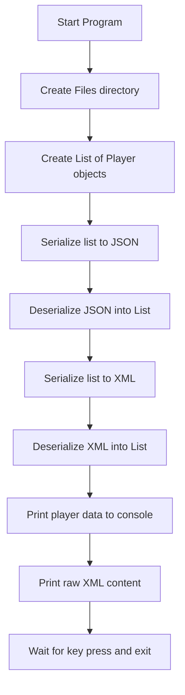
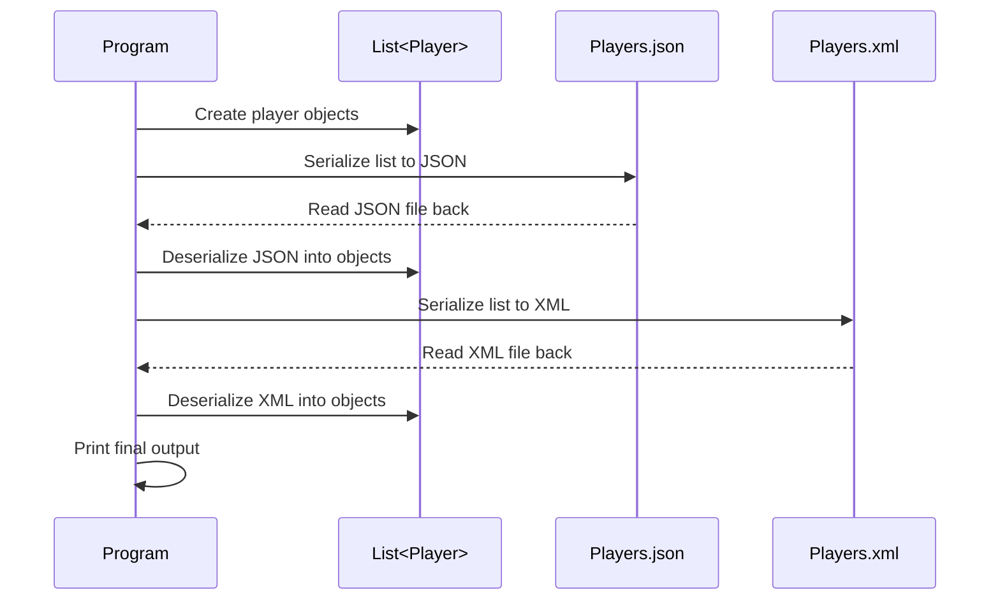
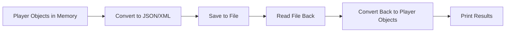
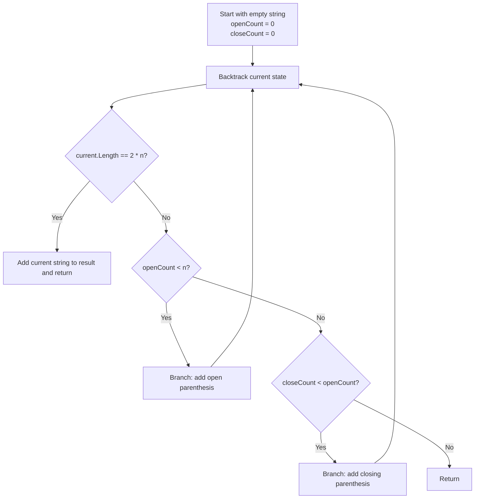
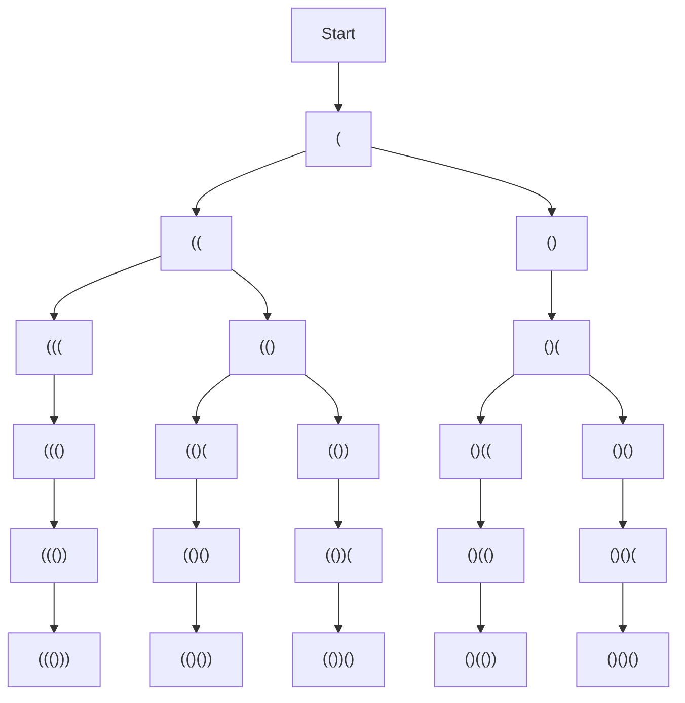
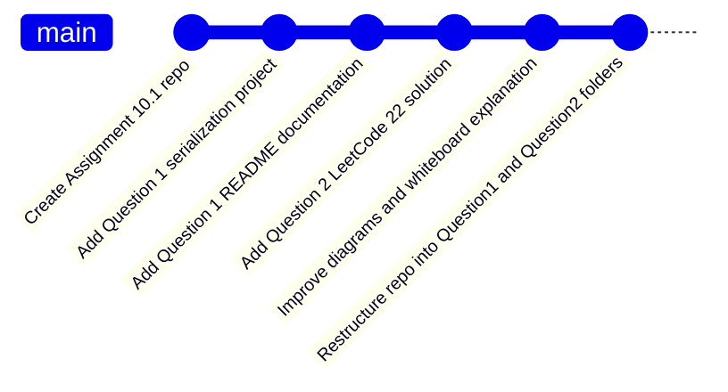

<p align="center">
  
</p>

# Assignment 10.1 - Serialization and LeetCode 22

> A C# assignment repository that demonstrates object serialization with **JSON** and **XML**, along with a backtracking solution to **LeetCode 22: Generate Parentheses**.

---

## Overview

This repository contains my work for **Assignment 10.1**, organized into two questions that focus on different C# and software engineering concepts.

- **Question 1:** Create a user-defined class and serialize and deserialize data using JSON and XML
- **Question 2:** Solve LeetCode 22, **Generate Parentheses**, using recursion and backtracking

Together, these two questions demonstrate both practical file-handling skills and algorithmic problem-solving.

---

## Why this assignment matters

This assignment helped reinforce several important concepts that show up often in backend and application development:

- Creating custom classes
- Working with object collections
- Using built-in serializers
- Reading from and writing to files
- Understanding recursion and backtracking
- Explaining technical logic clearly in documentation

It also helped me present coursework in a more professional GitHub-ready format.

---

## Tech Stack

- **Language:** C#
- **Framework:** .NET Console Application
- **Serialization Libraries:**
  - `System.Text.Json`
  - `System.Xml.Serialization`
- **Concepts Used:**
  - Object modeling
  - File handling
  - Serialization and deserialization
  - Recursion
  - Backtracking
- **IDE:** Visual Studio
- **Version Control:** Git / GitHub

---

## Project Structure

```text
Rovy Assignment List Serialization (Json & XML)/
├── README.md
├── .gitignore
├── Question1-Serialization/
│   ├── Program.cs
│   ├── Player.cs
│   └── Question1-Serialization.csproj
├── Question2-GenerateParentheses/
│   └── Program.cs
├── bin/
└── obj/
```

---

## Repository Contents

| Question | Topic | Description |
|---|---|---|
| Question 1 | Serialization | Creates a custom `Player` class and demonstrates JSON and XML serialization/deserialization |
| Question 2 | LeetCode 22 | Generates all valid parentheses combinations using recursion and backtracking |

---

## Question 1 - Player Serialization

Question 1 focuses on creating a user-defined `Player` class with three properties and demonstrating how object data can be serialized and deserialized using multiple file formats.

### Player Class

This project uses a custom `Player` class with three properties:

| Property | Type | Description |
|---|---|---|
| `Name` | `string` | Player name |
| `Team` | `string` | Team name |
| `PointsPerGame` | `float` | Average points scored per game |

Example:

```csharp
public class Player
{
    public string Name { get; set; }
    public string Team { get; set; }
    public float PointsPerGame { get; set; }
}
```

### Question 1 Workflow



### Serialization Flow



### Whiteboard Explanation (Question 1)

If I had to explain Question 1 on a whiteboard, I would break it down into four simple steps.

#### Step 1: Create the data

A custom `Player` class is created with three properties:

- Name
- Team
- PointsPerGame

A list of `Player` objects is then populated with sample data.

#### Step 2: Serialize the list

Serialization means converting objects in memory into a format that can be stored in a file.

In this application:

- JSON serialization writes the player list to a `.json` file
- XML serialization writes the player list to a `.xml` file

#### Step 3: Deserialize the list

Deserialization means reading stored file data and turning it back into C# objects.

In this project:

- The JSON file is read back into a `List<Player>`
- The XML file is read back into a `List<Player>`

#### Step 4: Verify the round trip

To confirm the process worked correctly:

- The deserialized players are printed to the console
- The raw XML content is displayed for inspection

### Simple Diagram



That full round trip is:

**object -> file -> object again**

### JSON Process

The JSON portion of the program follows these steps:

1. Create the file path.
2. Open a file stream.
3. Serialize the `List<Player>` into the JSON file.
4. Reset the stream position to the beginning.
5. Deserialize the file back into a `List<Player>`.
6. Print each restored player to the console.

### XML Process

The XML portion of the program follows these steps:

1. Create the file path.
2. Create an `XmlSerializer` for `List<Player>`.
3. Write the player list into the XML file.
4. Open the XML file again for reading.
5. Deserialize the XML back into a `List<Player>`.
6. Print each restored player to the console.
7. Read and display the raw XML text.

### Example Console Output

```text
--- JSON Serialization ---

List serialized to JSON. Reading it back...

Jalen Brunson - New York Knicks - 25.6
Victor Wembanyama - San Antonio Spurs - 22.3
Michael Jordan - Chicago Bulls - 33.4

--- XML Serialization ---

List serialized to XML. Reading it back...

Jalen Brunson - New York Knicks - 25.6
Victor Wembanyama - San Antonio Spurs - 22.3
Michael Jordan - Chicago Bulls - 33.4

--- Raw XML content ---
<?xml version="1.0"?>
<ArrayOfPlayer>
  ...
</ArrayOfPlayer>
```

---

## Question 2 - LeetCode 22: Generate Parentheses

Question 2 focuses on solving the classic **Generate Parentheses** problem using recursion and backtracking. This is a common interview-style question that tests how well you understand recursive state and pruning invalid paths early.

### Problem Statement

Given `n` pairs of parentheses, write a function to generate all combinations of well-formed parentheses.

### Example 1

```text
Input: n = 3
Output: ["((()))","(()())","(())()","()(())","()()()"]
```

### Example 2

```text
Input: n = 1
Output: ["()"]
```

### Solution Code (core logic)

```csharp
using System;
using System.Collections.Generic;

public class Solution
{
    public IList<string> GenerateParenthesis(int n)
    {
        var result = new List<string>();
        Backtrack(result, "", 0, 0, n);
        return result;
    }

    private void Backtrack(List<string> result, string current, int openCount, int closeCount, int n)
    {
        // Base case: when the string length reaches 2 * n,
        // we have used all parentheses and formed a complete combination.
        if (current.Length == 2 * n)
        {
            result.Add(current);
            return;
        }

        // Choice 1: add an opening parenthesis if we still have some left.
        if (openCount < n)
        {
            Backtrack(result, current + "(", openCount + 1, closeCount, n);
        }

        // Choice 2: add a closing parenthesis if it keeps the string valid.
        if (closeCount < openCount)
        {
            Backtrack(result, current + ")", openCount, closeCount + 1, n);
        }
    }
}
```

The console project in `Question2-GenerateParentheses/Program.cs` wraps this solution in a `Main` method, prints all combinations for a given `n`, and includes beginner-friendly comments.

### Core Idea

The solution builds the string one character at a time.

At every step:

- add `"("` if `openCount < n`
- add `")"` only if `closeCount < openCount`
- once the string length becomes `2 * n`, add it to the result list

This ensures that invalid combinations are never explored.

### Question 2 Workflow



### Decision Rules

The recursive function keeps track of three pieces of state:

- `current` -> the string being built
- `openCount` -> how many opening parentheses have been used
- `closeCount` -> how many closing parentheses have been used

From any recursive state, there are only two legal moves:

1. Add `"("` if `openCount < n`
2. Add `")"` if `closeCount < openCount`

These rules guarantee that the algorithm only explores valid paths.

### Recursion Tree for n = 3



### Whiteboard Explanation (Question 2)

If I had to explain Question 2 on a whiteboard, I would break it down into five steps.

#### Step 1: Understand the goal

We need all possible strings made from `n` opening parentheses and `n` closing parentheses.

But not every string is valid.

A valid parentheses string must always stay balanced as it is being built.

#### Step 2: Define the recursive state

At each recursive call, the algorithm tracks:

- `current`
- `openCount`
- `closeCount`

This tells us:

- what string has already been built
- how many opening parentheses have been used
- how many closing parentheses have been used

#### Step 3: Define the legal choices

At any point, there are only two possible moves:

- add `"("` if there are still opening parentheses left to use
- add `")"` if closing the string would not make it invalid

That means:

- `openCount < n`
- `closeCount < openCount`

If a move breaks one of those rules, that branch is not explored.

#### Step 4: Define the base case

Once `current.Length == 2 * n`, the string is complete.

At that point:

- it contains exactly `n` opening parentheses
- it contains exactly `n` closing parentheses
- it stayed valid the whole time

So the string is added to the result list.

#### Step 5: Explain backtracking

Backtracking means:

- make one valid choice
- go deeper into recursion
- return to the previous state
- try the next valid choice

This process continues until every valid combination has been generated.

### Mental Model

A simple way to think about this problem is like walking through a maze with rules.

Each step gives two possible directions:

- place an opening parenthesis
- place a closing parenthesis

But some paths are blocked:

- you cannot use more than `n` opening parentheses
- you cannot close more parentheses than you have opened

That means the algorithm does not waste time building invalid strings.

### Example Output

```text
For n = 3:
((()))
(()())
(())()
()(())
()()()
```

---

## How to Run

### Question 1

1. Open the serialization project in **Visual Studio**.
2. Build the solution.
3. Run the program.
4. View the console output.
5. Check the generated files.

Expected files:

- `Players.json`
- `Players.xml`

### Question 2

1. Open the Generate Parentheses project in **Visual Studio** (folder: `Question2-GenerateParentheses`).
2. Build the solution.
3. Run the program.
4. View the generated combinations in the console output.

---

## Development Flow



---

## What I Learned

This assignment helped build confidence in:

- Creating user-defined classes
- Working with lists of objects
- Writing structured data to files
- Reading stored data back into objects
- Understanding the differences between JSON and XML
- Using recursion to solve algorithmic problems
- Applying backtracking to generate valid combinations
- Explaining technical processes step by step

---

## Future Improvements

Possible next steps for this repository include:

- Adding input validation to both questions
- Saving Question 1 files to a relative folder
- Adding `try/catch` error handling
- Allowing user input for Question 2
- Comparing brute-force and backtracking approaches
- Adding unit tests for both questions

---

## Author

**Bobby Rovy**  
Army veteran transitioning into tech with a focus on backend development, cloud, security, and building strong C# fundamentals.
